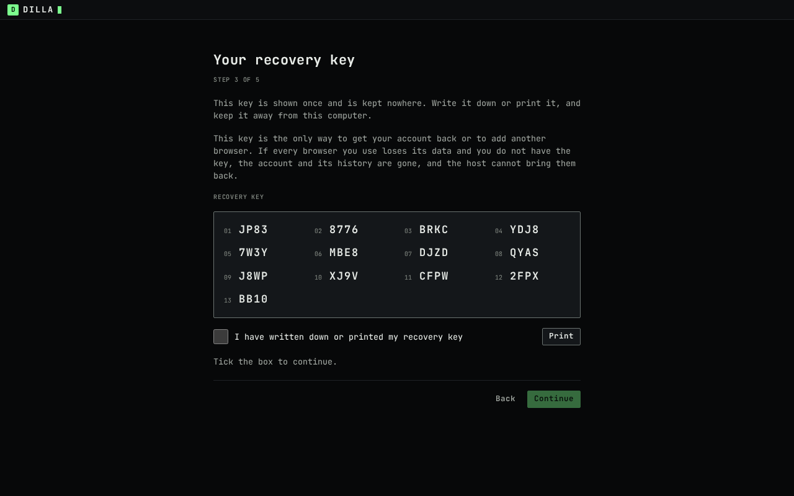
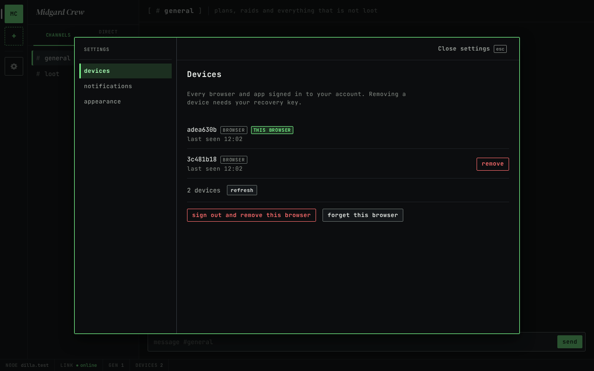
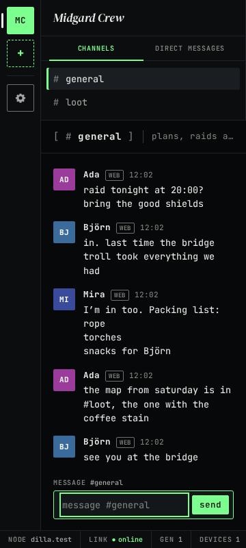

# dilla

> **Not audited. Not for production.** dilla is under construction. Nothing here has had an
> independent security review, and the project makes no end-to-end encryption claim until one is
> published. Run it only to develop it.

dilla is an open-source, self-hosted alternative to Discord, for a group that wants to leave Discord and
host its own place to talk: servers with text channels and drop-in voice, DMs, roles and permissions,
screen share and bots, with end-to-end encryption as the silent default. An instance is one Go binary,
`dillad`, that serves the HTTP API, the WebSocket gateway, the MLS delivery service, the LiveKit media
server, the TURN relay and the web client, on SQLite or Postgres. Anyone who can run one process on a
machine their group can reach can host it.

## What works today

As of 2026-10-07.

| Part | State |
|---|---|
| The server, `dillad` | Accounts and devices, servers (communities in the API), text channels, DMs, roles, permissions and channel overwrites, kicks and bans, invites, attachments (blobs), reports, encrypted backup objects; `dillad init`, `serve`, `doctor`, `backup`, `restore` and `admin`; TLS by ACME (TLS-ALPN, DNS or IP) or behind a proxy. Container image, systemd unit and Proxmox helper: see the [operator guide](docs/deploy/README.md). |
| Encrypted calls, at the protocol and media level | Voice, camera and screen share through the in-process LiveKit SFU and TURN relay, with every media frame encrypted end to end (SFrame keys from MLS), driven by the browser package `packages/media` and tested in Chromium and Firefox. The web client has no call screens yet. |
| The web client ("web-2a") | Served by `dillad` from its own address. Sign up with an invite, then use the account in a second browser: the recovery key first, then username and password, then the second-factor code if the account has one. Read and send text in channels and DMs; DMs stay reachable with no server or when a server did not load. Unread and mention badges appear in the channel list, the sidebar tabs and the server rail. Settings → Devices lists every browser and removes one with the recovery key, signs this browser out and removes it, or forgets it; it works at phone width and high zoom. A persistent warning shows when the instance holds recovery data that is not this account's, and a sign-in that another sign-in pushed out says so. Desktop notifications require opt-in and an open tab. Messages sent before a new browser joins are not shown there. One tab at a time per browser. Tested in Chromium and Firefox, and in WebKit for sign-up and reload. See [Getting started](docs/user/getting-started.md). |

## What is not there yet

As of 2026-10-07, in the web client:

- A native app or phone client. The recovery key adds another browser with the account password; it does not
  restore messages sent before that browser joined. Pins are not shared between browsers.
- Changing the password, setting up a second factor, or naming devices in the web client. There is no
  dedicated operator command yet to reset an account's recovery data, which the recovery-data warning asks for.
- Creating servers, channels and invites, or editing roles, permissions and profiles in the web client. A server
  is created through the HTTP API today.
- Voice, camera and screen share in the web client.
- Edits, deletes, reactions, replies, threads, mentions, attachments and link previews.
- Search, typing and presence. Desktop notifications stop when every tab is closed.
- Safety numbers and device verification.
- More than one open tab per browser (a second tab waits for the first).

Beyond the web client: no desktop or mobile app, no published security review, and no published capacity
figures yet.

## Run it

The [operator guide](docs/deploy/README.md) covers the container image, the systemd unit and the Proxmox
helper, the TLS modes, the TURN relay and LiveKit settings, and backup and restore.

## Use it

[Getting started](docs/user/getting-started.md) is for a person with an invite: the sign-up, what the
browser keeps, the app and its keyboard, and the known limits.

## Repository layout

| Path | What |
|---|---|
| `protocol/` | Normative protocol documents and conformance test vectors (Apache-2.0) |
| `packages/protocol-vectors` | TypeScript reference implementation that generates the vectors (Apache-2.0) |
| `docs/superpowers/specs` | Product and system design specifications |
| `docs/superpowers/plans` | Implementation plans |
| `docs/design` | Design brief and the Mesh design reference |
| `docs/deploy` | The operator guide |
| `docs/user` | The user guide and its screenshots |

## Licence

Server and clients: AGPL-3.0-or-later (`LICENSE`). Protocol documents, test vectors and SDK
libraries: Apache-2.0 (`LICENSE-APACHE`). Contributions are accepted under the Developer
Certificate of Origin (`DCO`): sign off every commit with `git commit -s`.
