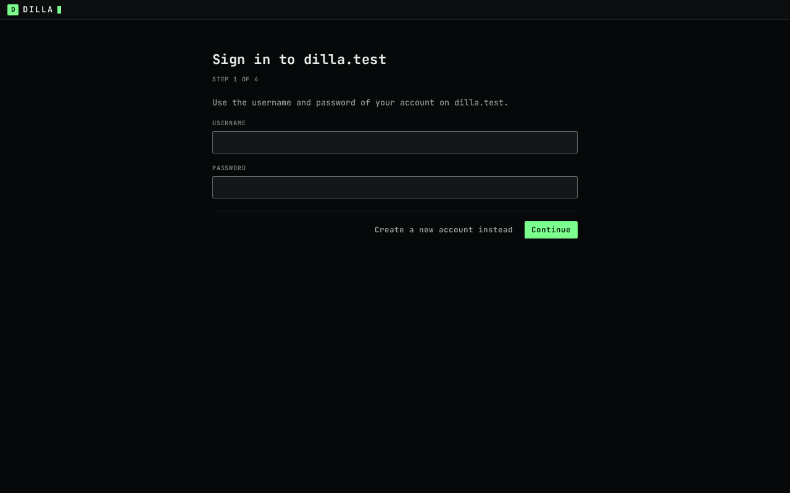
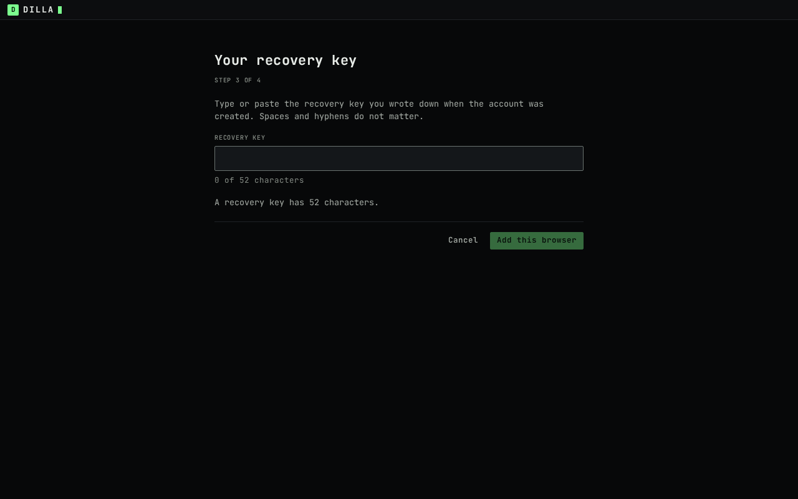

# Getting started with the dilla web client

This page is for a person who has been sent an invite to a dilla instance. It describes the web client
as it is on 2026-10-07 ("web-2a"): signing up, adding a second browser, using channels and direct
messages, and what the client cannot do yet. Every quoted line is the text the screen shows;
`{instance}` stands for the instance's address and `{username}` for yours.

If you run the instance yourself, start with the [operator guide](../deploy/README.md).

## 1. Open the invite

An invite is a code or a link. A link to an instance looks like `https://chat.example.org/i/<code>`.
Opening it shows a plain page from the instance:


It names the instance, the server the invite is for (the page calls it a community), the code, how long
the invite is valid and how many more times it can be used. It never asks for a password. Opening the page
does not use the invite. **Open dilla in this browser** starts the sign-up with the code filled in. You can
also go to the instance's address and paste the code or the whole link in the first step.

## 2. Sign up: five steps

All five steps happen in the same tab. **Continue** (or Enter in a field) moves forward, **Back** goes back
one step, and nothing is created on the instance until step 4.

### Step 1 of 5: Join


"You need an invite from someone on {instance}. Paste it below." The field takes "A code or a link, as you
received it." If the invite is refused when the account is created, you are brought back here with "This
invite is expired, used up or unknown. Ask for a new one." An instance that takes no new accounts shows
"{instance} is not taking new accounts" instead of this step.

### Step 2 of 5: Choose your name


"People on {instance} see these next to your messages."

- **Username**: "3 to 32 characters: a–z, 0–9, dot, underscore or hyphen." Capital letters are turned into
  lower case. If someone has it already: "That username is taken. Try another."
- **Display name (optional)**: "Up to 64 characters. Your username is shown when this is empty." This is
  the name shown on your messages.
- **Password**: only when the instance offers passwords. "At least 8 characters." Keep it: a second browser
  asks for this password and your recovery key.

Going forward from this step makes your keys. That can take a moment ("Making your keys").

### Step 3 of 5: Your recovery key


The key is 13 groups of 4 characters. "This key is shown once and is kept nowhere. Write it down or print
it, and keep it away from this computer." **Print** opens the browser's print dialog; the printed page holds
the key and the two paragraphs, not the rest of the screen. There is no copy button, on purpose: the
clipboard is readable by other programs. You can still select the text yourself.

The screen says: "This key is the only way to get your account back or to add another browser. If every browser you use loses its data and you do not have the key, the account and its history are gone, and the host cannot bring them back." It cannot be shown again after you leave this step.

Tick "I have written down or printed my recovery key" to continue ("Tick the box to continue.").

### Step 4 of 5: What this browser keeps


- "This browser now holds the key of this device, in its storage for {instance}. The key never leaves this
  browser."
- "Clearing this site’s data removes the key and the messages kept here, and this browser stops being your
  device."
- "To use this account in another browser, sign in there with your password and this recovery key. Messages sent before that browser joins are not shown in it."
- "A private window forgets all of this when it closes."

**Create account** creates the account on the instance ("Creating your account on {instance}…").

### Step 5 of 5: You’re in


"You are {username} on {instance}." **Open dilla** opens the app.

If the invite was for a server, you land in that server. Creating the account uses the invite once and
joining the server uses it a second time, so an invite that can be used only once creates the account and
then shows the join dialog with "This invite is expired, used up or unknown."; ask for a new server invite.
If the invite was for the instance only, the app shows "You are not in a server yet" and **Join a server**.

## 3. What "this browser holds your key" means

Each browser you add is a device of your account. When you sign up, the browser makes a key for itself (a
"device" key) and keeps it in its storage for the instance's address. The messages of a text channel are
encrypted end to end with MLS (RFC 9420) between the members' devices, and the instance stores and forwards
them encrypted. This browser decrypts them and keeps a copy in that same storage, itself encrypted with a key
that only this browser can unwrap. The next time you open the instance's address, the browser signs in with
its device key, without a password. (Nothing here has had an independent security review yet, and this
version still trusts the instance to check which devices join a channel; see the limits at the end.)

What follows from that:

- **Clearing the site's data** (the browser's "clear cookies and site data" for the instance, or removing
  the browser profile) deletes that browser's device key and kept messages. You can add a fresh browser with
  your password and recovery key, but messages from before it joins are not shown there.
- **If only the key is gone** and the stored data is still there, the app says "This browser can no longer
  open its saved data" and offers **Reset this browser**, which, after "Reset this browser?", deletes dilla's
  data for this site so you can sign up again.
- **Private windows.** Firefox's private window cannot keep the data at all; the app stops at "This window
  cannot keep dilla’s data" and creates no account. A Chromium incognito window lets you sign up, and the
  account is gone when the window closes. Use a normal window.
- **Browsers that clean up storage.** The app asks the browser once to keep its storage, and some browsers
  decline. Safari removes a site's storage after seven days without interaction, and the account goes with
  it.
- **Another tab.** Only one tab runs dilla at a time. A second tab shows "dilla is open in another tab" and
  takes over when the first one closes.
- **Signed out by the account.** If the account no longer accepts this browser, the app says "This browser
  was signed out". Settings → Devices can remove a device or "sign out and remove this browser".

## 4. The app


From left to right:

- **The server rail.** One tile per server you are in, with its initials. The dashed **+** tile is "join a
  server": paste a server invite ("A server invite, as a code or a link.") and press **Join**. The last tile
  is "settings"; a number on a server tile counts its unread channels.
- **The channel list.** The server's name and its channels. Text channels open here. Voice channels and
  channels the server can read ("Readable by this server") are listed, and selecting one shows "This channel
  does not open here yet". The "channels" and "direct messages" tabs switch the list; an unread channel has
  a badge, and mentions have their own count. Opening a channel marks it read.
- **The conversation.** The channel's name and topic at the top, the messages, and the message field
  ("message #general") with **send**. Each message shows the author's display name, a small `web` tag when it
  was sent from a browser, and the time. A message is at most 4000 bytes; in the last 400 the field shows
  how many are left. While a message is on its way it shows "sending…"; one that could not be sent shows "not sent" with
  **retry** and **discard**.
- **The status bar.** `node` is the instance, `link` is the connection (online, connecting or offline) and
  `gen` is the instance's generation number. When the connection drops, a banner says "Connection lost.
  Reconnecting…".

At phone width the channel list sits above the conversation:


### Keyboard

| Key | What it does |
|---|---|
| Enter | Sends the message |
| Shift+Enter | Starts a new line in the message |
| Alt+Arrow Up, Alt+Arrow Down | Opens the previous or next channel, from anywhere in the app |
| Escape | In the message list: back to the message field. In a dialog: closes it |
| Tab, Shift+Tab | Moves between the regions: "skip to messages", the server rail, the channel list, the channel header, the messages, the message field, the status bar |
| Arrow keys | Move within the server rail and the channel list, which are one Tab stop each |

The sidebar tabs are one more Tab stop. Arrow Left and Arrow Right switch between "channels" and "direct messages".
Settings uses Arrow Up, Arrow Down, Home and End to move between sections; Escape closes it.

Every step of the sign-up works with the keyboard alone: Tab to a field or button, Space ticks the
recovery-key box, Enter submits a step.

### Reloading

Reload the page, or close the browser and come back: the app opens without the sign-up, with your servers,
your channels and the messages this browser has received. They are read back from this browser's storage,
not from the instance, and the newest 100 messages of a channel are shown first; **load earlier** shows more.
"nothing here yet. Messages sent before this browser joined are not shown." is what an empty channel says:
a channel's history starts when this browser joined it.

## 5. When something is wrong

### You are no longer a member


If you were removed from the server while the tab was open, the next message you send is
"not sent" and the message field is blocked with "you cannot post in this channel and new messages will not
arrive. Reload, or ask the host." Ask whoever runs the server for a new invite. Once you have joined again,
reload the page: the channel opens again and new messages arrive. Messages sent while you were out are not
shown.

### A message could not be read

A message this browser could not decrypt is shown as "This message could not be read on this device." with
a short code (for example `E_CORE_MLS`) instead of its text. Nothing in this version can recover it.

### Other messages

| The app shows | What to do |
|---|---|
| "This channel did not open" | **try again**; the code in brackets says what failed |
| "This server did not load ({code})." | **try again** in the channel list |
| "That did not work ({code}). Try again, or reload the page." | Dismiss it and try again, or reload |
| "This server needs a newer client. Reload the page." | Reload, which loads the instance's current client |
| "dilla could not start" | **Reload** |
| "Too many attempts from this network." | Wait as long as it says, then try again |

## 6. Add another browser



On a new browser choose **Use an existing account**. "Sign in to {instance}" asks for your username and
password. If the account uses a second factor, "Your second factor" asks for its six-digit code. Then
"Your recovery key" says: "Type or paste the recovery key you wrote down when the account was created.
Spaces and hyphens do not matter." **Add this browser** adds its device.



The final step says "This browser is now a device of {username} on {instance}. Messages sent before now are
not shown here." The new browser sees new messages, not the earlier channel archive. A rejected key says
"This is not the recovery key of this account. Check every character." A registration 429 says "Too many
sign-in attempts. Try again in {seconds} s." and asks you to wait briefly.


## 7. Devices and notifications

Open **settings** in the server rail, then **devices**. "Every browser and app signed in to your account.
Removing a device needs your recovery key." A row marked "this browser" is the one you are using. **remove**
on another listed device asks for the recovery key; "sign out and remove this browser" clears this browser
and removes its device. "forget this browser" clears its data here but leaves its device in the account list
until removed elsewhere.


Under **notifications**, "Desktop notifications show while a dilla tab is open. Nothing is shown when every
tab is closed." Choose **turn on** to ask the browser for permission. The default "notify me about" choices
are "direct messages and mentions", "every message" and "nothing". "Per channel" lets you choose "default",
"all", "mentions" or "nothing", and "mute" a channel. A muted channel still shows its mention badge.


In **direct messages**, choose **message someone**, pick a member and send text. Replies badge the DM until
you open it. A DM that another member starts also appears without reloading.


## 8. Known limits (2026-10-07)

- No native phone or desktop app. A second browser needs both the password and recovery key. Pins are local
  to one browser; a new browser does not get messages from before it joined.
- No server, channel or invite can be created from the web client, and there are no roles, permissions or
  profile screens. A server invite has to come from someone who can make one through
  the instance's API, or from the host (`dillad admin invite create`).
- Text channels and DMs only. No voice, camera or screen share (the server and the media layer support
  encrypted calls; the web client has no call screens yet).
- Plain text only. No edits, deletes, reactions, replies, threads, mentions, attachments, link previews,
  markdown or emoji picker.
- No search, typing or presence. Notifications require an open tab and browser permission.
- Messages from before this browser joined a channel are not shown.
- No safety numbers and no device verification. The name on a message is the device that encrypted it, as
  the channel's encryption group authenticates it; nothing in the client checks yet that the device belongs
  to the person named, so the client trusts the instance's check of new devices.
- If the page is reloaded while the account is being created, the account is finished but the server the
  invite named is not joined; paste the invite into **Join a server**.
- Tested with Chromium and Firefox, and with WebKit for sign-up and reload; Safari itself has not been
  verified.

## Re-shooting these screenshots

The screenshots are real: `e2e/scripts/shoot-docs.mjs` starts a `dilla-testhost` that serves the built
client, creates the server "Midgard Crew", signs ada, björn and mira up in three Chromium profiles, signs
mira into a fourth, and photographs the flows. Every name and message is made up, and the accounts are deleted with the test
host. To re-shoot them (not part of CI):

```sh
npm run build -w @dilla/web
GO=/home/thim/.local/go/bin/go TMPDIR=/tmp/w23 npm run docs:shots -w @dilla/e2e
```

It needs `internal/mlswasi/testdata/dilla_core_wasi.wasm` and Playwright's Chromium, uses
127.0.0.1:8471 and 8472 (`node e2e/scripts/shoot-docs.mjs --port P --control C` picks others) and writes
`docs/user/screenshots/*.png`.
