# Getting started with the dilla web client

This page is for a person who has been sent an invite to a dilla instance. It describes the web client
as it is on 2026-10-07 ("web-2b"): signing up, using the account in a second browser, devices, channels,
direct messages, badges and notifications, saying more (edits, deletes, reactions, replies, pins, mentions,
images and files), and what the client cannot do yet. Every quoted line is the text the screen shows;
`{instance}` stands for the instance's address and `{username}` for yours.

If you run the instance yourself, start with the [operator guide](../deploy/README.md).

## 1. Open the invite

An invite is a code or a link. A link to an instance looks like `https://chat.example.org/i/<code>`.
Opening it shows a plain page from the instance:


It names the instance, the server the invite is for (the page calls it a community), the code, how long
the invite is valid and how many more times it can be used. It never asks for a password. Opening the page
does not use the invite. **Open dilla in this browser** starts the sign-up with the code filled in. You can
also go to the instance's address and paste the code or the whole link in the first step.

## 2. Sign up: five steps

All five steps happen in the same tab. **Continue** (or Enter in a field) moves forward, **Back** goes back
one step, and nothing is created on the instance until step 4.

### Step 1 of 5: Join

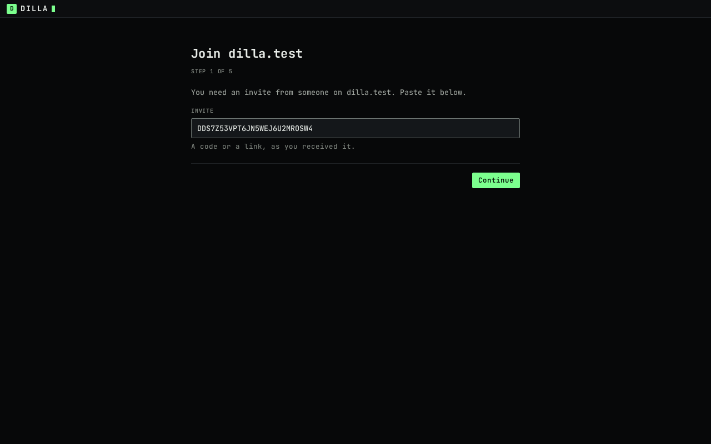

"You need an invite from someone on {instance}. Paste it below." The field takes "A code or a link, as you
received it." If the invite is refused when the account is created, you are brought back here with "This
invite is expired, used up or unknown. Ask for a new one." An instance that takes no new accounts shows
"{instance} is not taking new accounts" instead of this step.

### Step 2 of 5: Choose your name

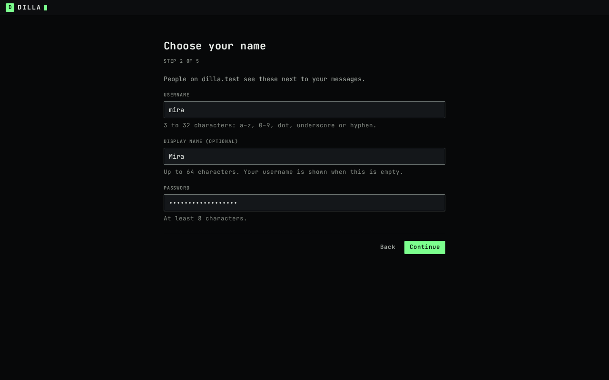

"People on {instance} see these next to your messages."

- **Username**: "3 to 32 characters: a–z, 0–9, dot, underscore or hyphen." Capital letters are turned into
  lower case. If someone has it already: "That username is taken. Try another."
- **Display name (optional)**: "Up to 64 characters. Your username is shown when this is empty." This is
  the name shown on your messages.
- **Password**: only when the instance offers passwords. "At least 8 characters." Keep it: a second browser
  asks for this password and your recovery key.

Going forward from this step makes your keys. That can take a moment ("Making your keys").

### Step 3 of 5: Your recovery key


The key is 13 groups of 4 characters. "This key is shown once and is kept nowhere. Write it down or print
it, and keep it away from this computer." **Print** opens the browser's print dialog; the printed page holds
the key and the two paragraphs, not the rest of the screen. There is no copy button, on purpose: the
clipboard is readable by other programs. You can still select the text yourself.

The screen says: "This key is the only way to get your account back or to add another browser. If every browser you use loses its data and you do not have the key, the account and its history are gone, and the host cannot bring them back." It cannot be shown again after you leave this step.

Tick "I have written down or printed my recovery key" to continue ("Tick the box to continue.").

### Step 4 of 5: What this browser keeps

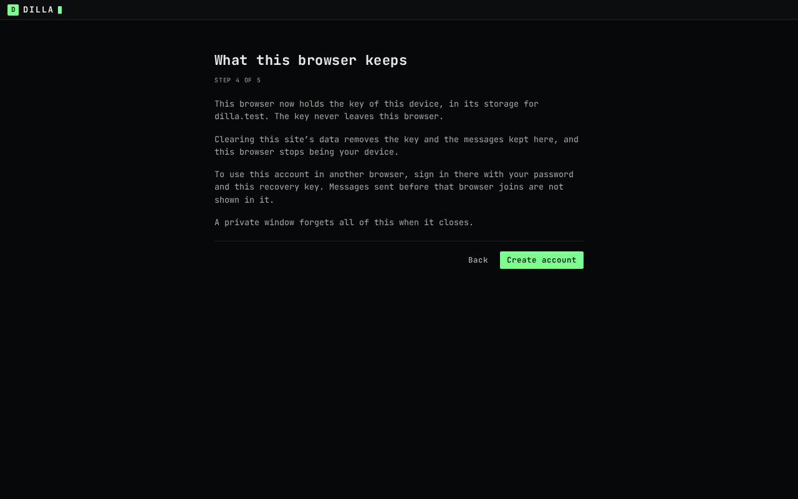

- "This browser now holds the key of this device, in its storage for {instance}. The key never leaves this
  browser."
- "Clearing this site’s data removes the key and the messages kept here, and this browser stops being your
  device."
- "To use this account in another browser, sign in there with your password and this recovery key. Messages sent before that browser joins are not shown in it."
- "A private window forgets all of this when it closes."

**Create account** creates the account on the instance ("Creating your account on {instance}…").

### Step 5 of 5: You’re in

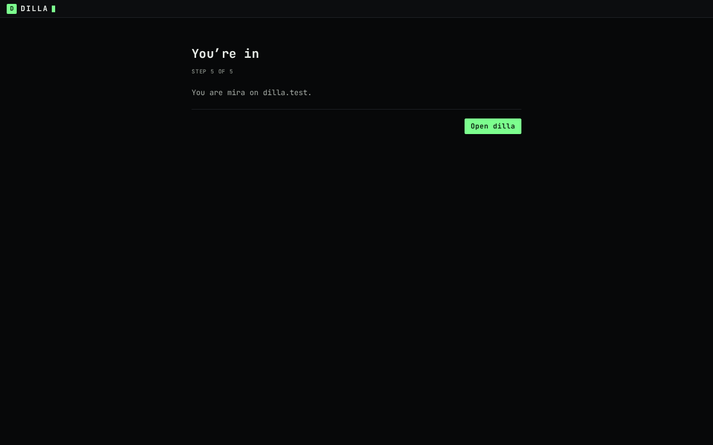

"You are {username} on {instance}." **Open dilla** opens the app.

If the invite was for a server, you land in that server. Creating the account uses the invite once and
joining the server uses it a second time, so an invite that can be used only once creates the account and
then shows the join dialog with "This invite is expired, used up or unknown."; ask for a new server invite.
If the invite was for the instance only, the app shows "You are not in a server yet" and **Join a server**.

## 3. What "this browser holds your key" means

Each browser you add is a device of your account. When you sign up, the browser makes a key for itself (a
"device" key) and keeps it in its storage for the instance's address. The messages of a text channel are
encrypted end to end with MLS (RFC 9420) between the members' devices, and the instance stores and forwards
them encrypted. This browser decrypts them and keeps a copy in that same storage, itself encrypted with a key
that only this browser can unwrap. The next time you open the instance's address, the browser signs in with
its device key, without a password. (Nothing here has had an independent security review yet, and this
version still trusts the instance to check which devices join a channel; see the limits at the end.)

What follows from that:

- **Clearing the site's data** (the browser's "clear cookies and site data" for the instance, or removing
  the browser profile) deletes that browser's device key and kept messages. You can add a fresh browser with
  your password and recovery key, but messages from before it joins are not shown there.
- **If only the key is gone** and the stored data is still there, the app says "This browser can no longer
  open its saved data" and offers **Reset this browser**, which, after "Reset this browser?", deletes dilla's
  data for this site so you can sign up again.
- **Private windows.** Firefox's private window cannot keep the data at all; the app stops at "This window
  cannot keep dilla’s data" and creates no account. A Chromium incognito window lets you sign up, and the
  account is gone when the window closes. Use a normal window.
- **Browsers that clean up storage.** The app asks the browser once to keep its storage, and some browsers
  decline. Safari removes a site's storage after seven days without interaction, and the account goes with
  it.
- **Another tab.** Only one tab runs dilla at a time. A second tab shows "dilla is open in another tab" and
  takes over when the first one closes.
- **Signed out by the account.** If the account no longer accepts this browser (another browser removed it
  in Settings → Devices), the app says "This browser was signed out". See [Devices](#7-devices).

## 4. The app


From left to right:

- **The server rail.** One tile per server you are in, with its initials. The dashed **+** tile is "join a
  server": paste a server invite ("A server invite, as a code or a link.") and press **Join**. The last tile
  is "settings"; a number on a server tile counts its unread channels.
- **The channel list.** The server's name and its channels. Text channels open here. Voice channels and
  channels the server can read ("Readable by this server") are listed, and selecting one shows "This channel
  does not open here yet". The "channels" and "direct messages" tabs switch the list; an unread channel has
  a badge, and mentions have their own count. Opening a channel marks it read.
- **The conversation.** The channel's name and topic at the top, the messages, and the message field
  ("message #general") with **send**. Each message shows the author's display name, a small `web` tag when it
  was sent from a browser, and the time. A message is at most 4000 bytes; in the last 400 the field shows
  how many are left. While a message is on its way it shows "sending…"; one that could not be sent shows "not sent" with
  **retry** and **discard**.
- **The status bar.** `node` is the instance, `link` is the connection (online, connecting or offline) and
  `gen` is the instance's generation number. When the connection drops, a banner says "Connection lost.
  Reconnecting…".

At phone width the channel list sits above the conversation:


### Keyboard

| Key | What it does |
|---|---|
| Enter | Sends the message |
| Shift+Enter | Starts a new line in the message |
| Alt+Arrow Up, Alt+Arrow Down | Opens the previous or next channel, from anywhere in the app |
| Escape | In the message list: back to the message field. In a dialog: closes it |
| Tab, Shift+Tab | Moves between the regions: "skip to messages", the server rail, the channel list, the channel header, the messages, the message field, the status bar |
| Arrow keys | Move within the server rail and the channel list, which are one Tab stop each |

The sidebar tabs are one more Tab stop. Arrow Left and Arrow Right switch between "channels" and "direct messages".
Settings uses Arrow Up, Arrow Down, Home and End to move between sections; Escape closes it.

Every step of the sign-up works with the keyboard alone: Tab to a field or button, Space ticks the
recovery-key box, Enter submits a step.

### Reloading

Reload the page, or close the browser and come back: the app opens without the sign-up, with your servers,
your channels and the messages this browser has received. They are read back from this browser's storage,
not from the instance, and the newest 100 messages of a channel are shown first; **load earlier** shows more.
"nothing here yet. Messages sent before this browser joined are not shown." is what an empty channel says:
a channel's history starts when this browser joined it.

## 5. When something is wrong

### You are no longer a member


If you were removed from the server while the tab was open, the next message you send is
"not sent" and the message field is blocked with "you cannot post in this channel and new messages will not
arrive. Reload, or ask the host." Ask whoever runs the server for a new invite. Once you have joined again,
reload the page: the channel opens again and new messages arrive. Messages sent while you were out are not
shown.

### A message could not be read

A message this browser could not decrypt is shown as "This message could not be read on this device." with
a short code (for example `E_CORE_MLS`) instead of its text. Nothing in this version can recover it.

### Other messages

| The app shows | What to do |
|---|---|
| "This channel did not open" | **try again**; the code in brackets says what failed |
| "This server did not load ({code})." | **try again** in the channel list |
| "That did not work ({code}). Try again, or reload the page." | Dismiss it and try again, or reload |
| "This server needs a newer client. Reload the page." | Reload, which loads the instance's current client |
| "dilla could not start" | **Reload** |
| "Too many attempts from this network." | Wait as long as it says, then try again |

## 6. Use your account in a second browser

You need three things: your username, your password and the recovery key you wrote down at sign-up. The
sign-in has four steps, in this order: the recovery key, then your username and password, then the code of
your second factor (only if the account has one), then done. Nothing is sent to the instance until the
second step, and the key is never written to the browser's storage.


On the new browser, open the instance's address and choose **Use an existing account** under the invite
field. The instance offers it only when it takes password logins. An instance that takes no new accounts
still shows the button.

### Step 1 of 4: Your recovery key

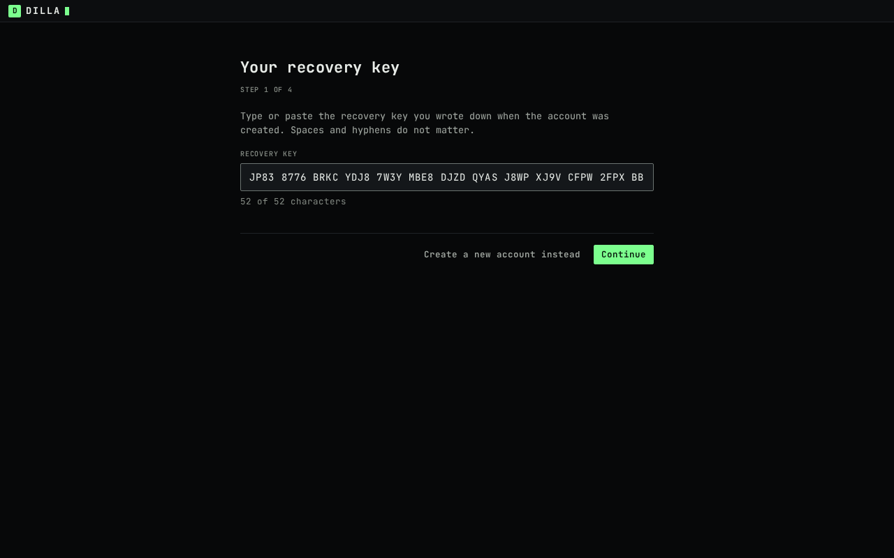

"Type or paste the recovery key you wrote down when the account was created. Spaces and hyphens do not
matter." The line under the field counts what you typed ("{n} of 52 characters"); **Continue** works once
it reads 52 ("A recovery key has 52 characters."). This step sends nothing: the page holds the key until
step 2. A key that cannot be a recovery key is refused when you continue from step 2, before your password
is sent, and a key of another account once the instance has answered; either way this step shows again with
what you typed and "This is not the recovery key of this account. Check every character." (after the
instance has answered, its button reads **Add this browser** and you do not sign in again). **Create a new
account instead** goes back to the sign-up.

### Step 2 of 4: Sign in to {instance}

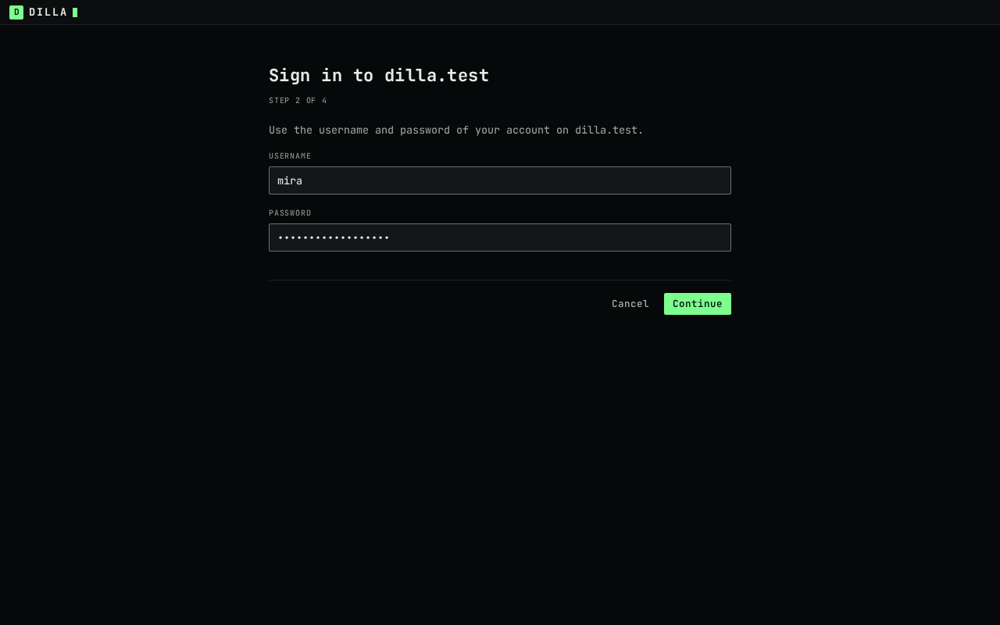

"Use the username and password of your account on {instance}." **Continue** checks them ("Checking…"). A
wrong pair says "That username and password did not work." and empties the password field. **Cancel** goes
back to the sign-up.

If the account has no second factor, this same step adds the browser to the account ("Adding this browser to
your account…") and goes straight to step 4.

### Step 3 of 4: Your second factor

Only for an account with a second factor: "Enter the six-digit code from your authenticator app." A wrong
code sends you back to step 2 with "That code did not work. Sign in again with a fresh code.", because the
instance has used up that login; type the password again and then a new code. A right code adds the
browser and goes on to step 4.

### Step 4 of 4: You’re in

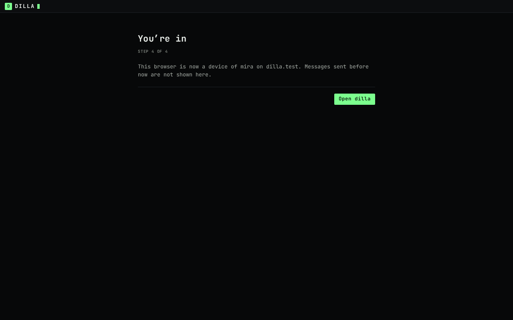

"This browser is now a device of {username} on {instance}. Messages sent before now are not shown here."
**Open dilla** opens the app. The new browser sees new messages, not what was said before it joined.

### If the sign-in stops

| The page shows | What it means and what to do |
|---|---|
| "This is not the recovery key of this account. Check every character." | The key is wrong (a typo, or another account's key). Correct it and continue |
| "Someone else is signing in to this account. Change your password from a device you still have, or ask the operator." | Another sign-in with your password took this browser's place before it was added. If that was not you, someone else has your password. The web client cannot change a password yet, so tell whoever runs the instance; meanwhile your other browsers keep working, and a device that signed in with the password alone cannot read anything. You land on step 2 or on the first page; sign in again once it is sorted out |
| "The account’s devices changed while you were signing in. Sign in again." | Another of your browsers changed the account's devices meanwhile. This browser's data was cleared; start again from **Use an existing account** |
| "This account already has as many devices as {instance} allows. Remove one in Settings on another device first." | Remove a device in Settings → Devices on a browser you still have, then continue |
| "Too many sign-in attempts. Try again in {seconds} s." | Wait that long, then continue |
| "This account has no backup to recover from on {instance}. Sign in on a device that still holds this account and open dilla there; it repairs the backup. Then try again." | Open dilla in a browser that already holds the account and let it connect; then sign in here again |
| "The connection dropped. Check it and try again." | Check the network and continue |

## 7. Devices

Open **settings** in the server rail, then **devices**. "Every browser and app signed in to your account.
Removing a device needs your recovery key." Each row is a device, named by the first eight characters of its
id, with the tag "browser" or "app" and when it was last seen. The row marked "this browser" is the one you
are using. "not yet in the device list" marks a device that signed in with your password but was never
added; "removed" marks one that was removed. **refresh** reads the list again.


- **remove** on another device: "Remove this device?" "The device is signed out everywhere and leaves every
  conversation. Enter your recovery key to confirm." **Remove** does it. A wrong key says "This is not the
  recovery key of this account." A device that is "not yet in the device list" is removed without the key:
  "This device signed in with your password but is not in the device list, so it cannot read anything.
  Removing it needs no recovery key."
- **sign out and remove this browser**: "This browser is removed from your account and its data here is
  cleared. You can sign in again later with your password and recovery key. Enter the key to confirm."
  **Sign out** removes it and reloads to the first page.
- **forget this browser**: "This clears dilla’s data from this browser and signs it out. The device stays in
  your account’s device list until you remove it from another device." No key is needed. Remove the row from
  another browser afterwards.

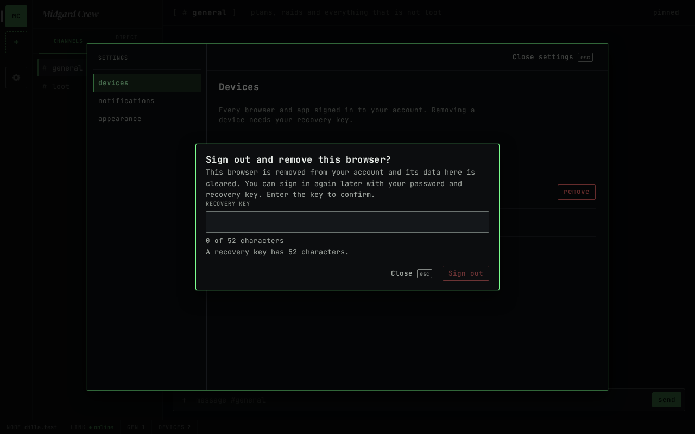

**If the recovery data is not yours.** If the instance holds recovery data that this account did not make,
a red warning stays at the top of the app and of Settings → Devices: "The recovery data stored for this
account on {instance} is not this account’s. The recovery key will not work until the operator resets it."
It cannot be dismissed. Until it goes away, removing a device with the key and adding a browser will fail;
keep using the browsers you have and ask whoever runs the instance to reset the account's recovery data.

Settings works at phone width and at high zoom: the sections stack above their content and the whole panel
scrolls as one column.

## 8. Badges, direct messages and notifications


A channel with unread messages shows a count, and mentions have their own count. The server's tile in the
rail counts its unread channels, and each sidebar tab adds up its rows: here #loot is unread and Ada has
answered a direct message. Opening a channel or a direct message marks it read. Your own messages, from any
of your browsers, never count as unread.

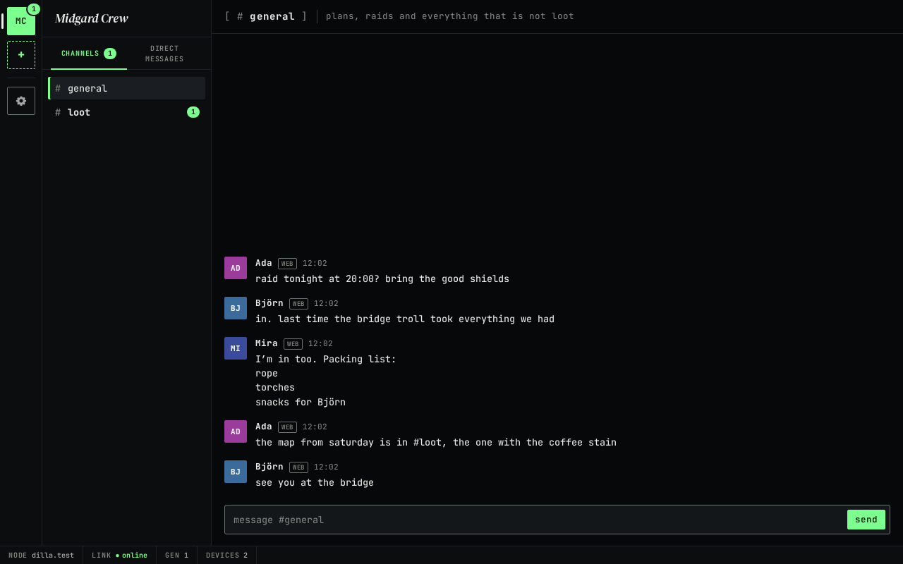

In **direct messages**, choose **message someone** ("Pick a member of this server."), choose **message** next
to a person and write. A direct message someone else starts appears without reloading. Direct messages stay
reachable when you are in no server, or when a server did not load: the **direct messages** tab is still
there, and the channels tab says what is wrong. Starting a new one needs a server, because the list of
people comes from it.

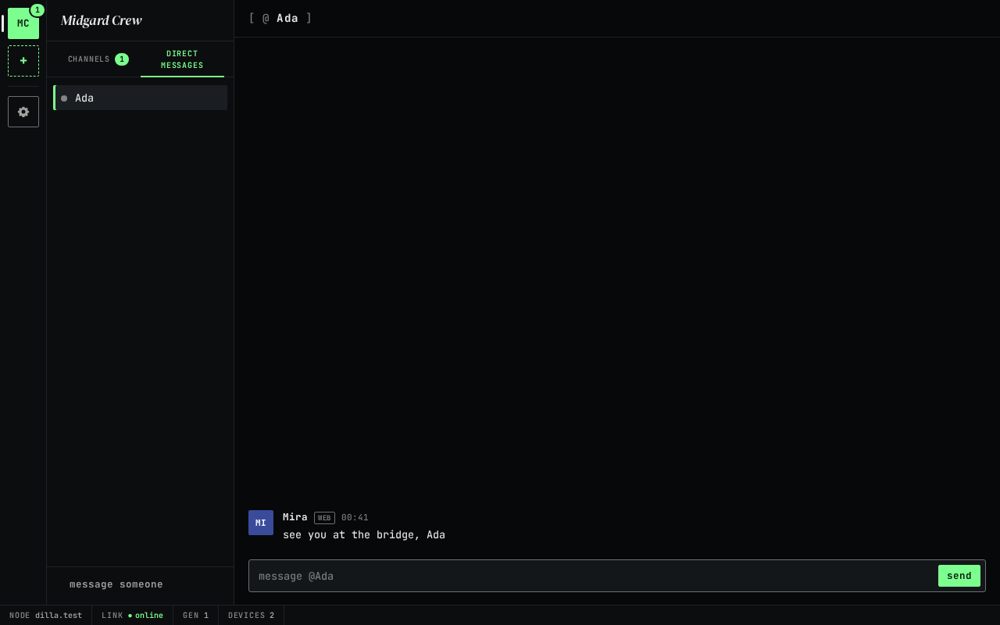

Under **notifications**, "Desktop notifications show while a dilla tab is open. Nothing is shown when every
tab is closed." Choose **turn on** to ask the browser for permission. The default "notify me about" choices
are "direct messages and mentions", "every message" and "nothing". "Per channel" lets you choose "default",
"all", "mentions" or "nothing", and "mute" a channel. A muted channel still shows its mention badge.

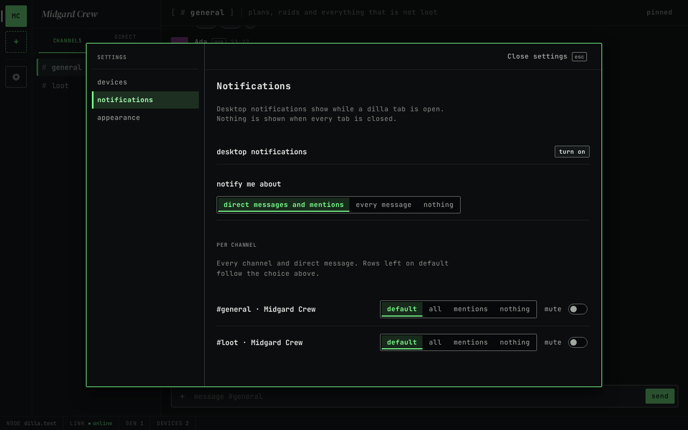

## 9. Saying more

A message can be edited, deleted, answered, reacted to and pinned, it can mention people, and it can carry images
and files. This works the same in channels and in direct messages.

### The message toolbar


Point at a message, or move to it with the keyboard, and its toolbar appears ("actions for this message"):
**react**, **reply** and **pin** (**unpin** on a pinned message), and on your own messages also **edit** and
**delete**. A change shows once it has gone through; until then the message says "saving…", and a change that
could not be made says "not saved" with **retry** and **discard**.

### Edit

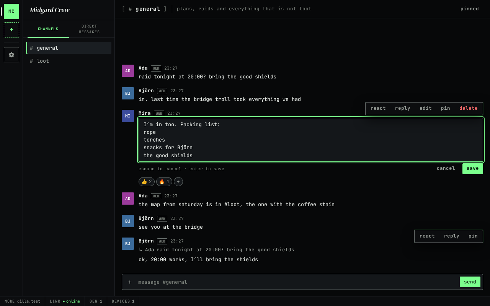

**edit** opens the message in place ("edit your message"); Arrow Up in an empty message field does the same for
your last message. Enter saves, Shift+Enter starts a new line, Escape cancels ("escape to cancel · enter to save").
An edited message shows "edited". Only the latest version is shown; there is no history of earlier ones. An edit
never notifies anyone, even when it adds a mention. You can edit your messages from any of your browsers, and
nobody else can edit them.

### Delete for everyone

**delete** asks first: "Delete this message?" "It is removed for everyone in this conversation, with its reactions
and files. Copies someone already saved stay with them. This cannot be undone." **Delete** removes the message
from every device in the conversation, also from devices that come online later, and the instance deletes its copy
of the message and the message's files. Where the message was, the conversation shows "message deleted". A delete
cannot reach a copy that someone saved or a screenshot someone took. Only the author can delete a message; there is
no moderator delete in this version. If the browser you deleted from leaves the conversation before it has asked
the instance to delete its copy, the instance keeps that copy until the browser rejoins or the instance's
retention removes it.

### Replies

**reply** puts "replying to {name}" and the start of that message above the message field; **cancel reply** or
Escape takes it away. The reply is shown with a line that names the original's author and its first words.
Selecting that line ("go to the original message") scrolls to the original and highlights it for a moment (with
reduced motion, an outline instead of the animation). When the original is further back than what is loaded:
"The original message is further back. Load earlier messages to reach it." When this browser never had it or
cannot read it: "the original message cannot be shown here". When it was deleted: "the original message was
deleted".

### Reactions

**react**, or **add a reaction** under a message that already has reactions, opens "pick a reaction": 32 emoji in
a grid. The arrow keys move, Enter picks, Escape closes. Each reaction shows its emoji and how many people chose
it; yours is highlighted, and selecting it again takes yours back. Each person counts once per emoji, whichever of
their browsers they use.

### Pins


**pin** pins a message for everyone in the conversation, and it shows "pinned". **pinned** in the channel header
opens "Pinned in #{channel}" ("Pinned with {name}" in a direct message): each pinned message with its author, its
time, its first words and "pinned by {name}", with **go to message** and **unpin**. With nothing pinned it says
"Nothing is pinned here yet." In this version anyone in the conversation can pin and unpin any message; the list
says who pinned each one.

### Mentions

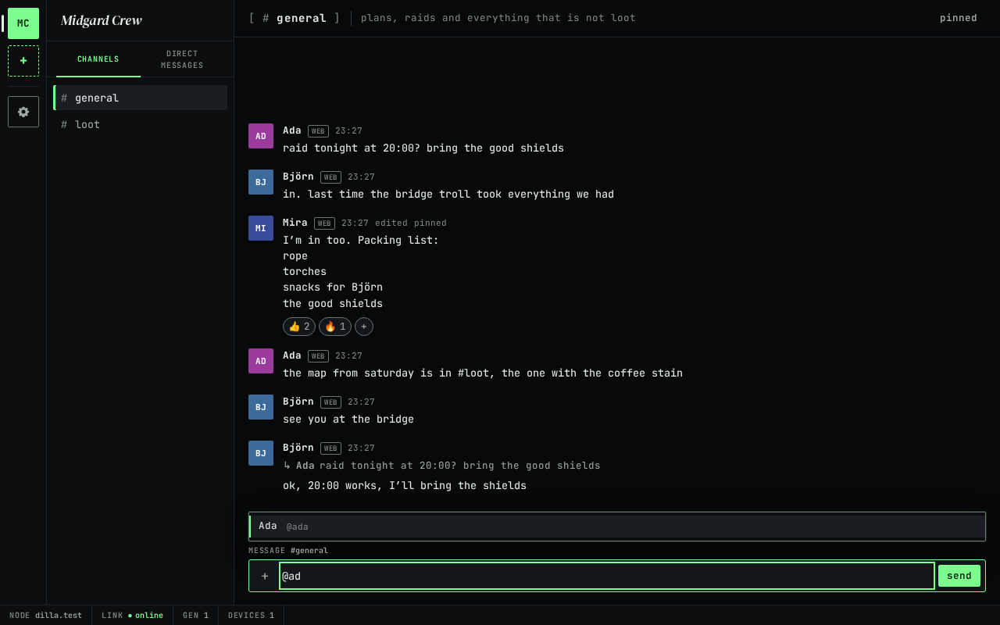

Type `@` and the first letters of someone's username or display name: the list ("people to mention") offers up to
eight members who match and, in a channel, "everyone in this channel". Arrow Up and Arrow Down move, Enter or Tab
picks, Escape closes the list. Typing a member's whole `@username` works too. The message carries the person, not
the text you typed, so it always shows their current name. A message that mentions you is marked, counts in the
mention badge and notifies you as your notification settings say (section 8). `@everyone` mentions everyone in the
channel; typing `@here` does the same (the client does not know who is online, so it offers no separate entry);
direct messages offer neither. A mention of a role shows as "@role" and counts as a mention of you once this browser has loaded the
server's member list.

### Images and files


**attach files** next to the message field, dropping files on the conversation ("Drop to attach", "Up to 4 files,
25 MB each.") or pasting them into the message field adds them to "files to send". Each file goes through
"reading", "preparing", "uploading" and "ready", or shows "failed ({code})"; **remove {name}** takes it off the
list. A message carries at most four files ("A message carries at most 4 files."), each at most 25 MB
(26,214,400 bytes) in a browser ("{name} is over 25 MB and cannot be sent from a browser."). The message goes when
every file is ready ("Wait until every file is ready, or remove it."), with or without text. Files are uploaded
as soon as you add them and become part of the conversation only when the message is sent; a file that is never
sent is removed by the instance after a while (after 24 hours, unless the instance is set otherwise). If a file
you attached is no longer on the server when the message is sent (an upload left for more than a day), the
message says so and offers only discard; attach the file again.

PNG, JPEG, WebP and GIF images show as a small preview made by the sender's browser ("open {name}"). Every other
file, audio, video and SVG included, shows as a card with its name, its size and **save**.

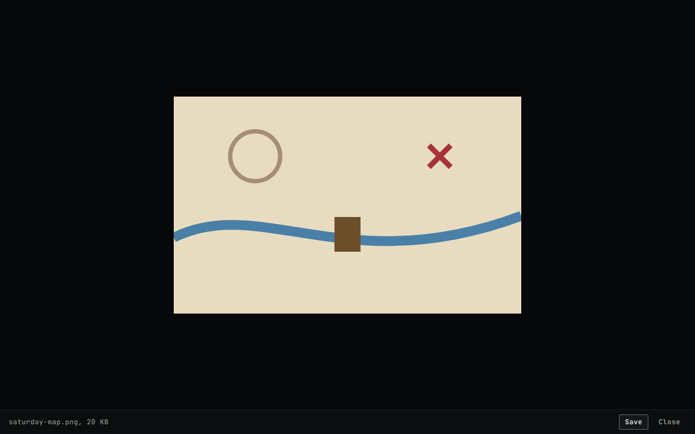

Opening an image shows it full size: **previous image** and **next image** (Arrow Left and Arrow Right) move
between the images of the same message, **Save** saves it, **Close** or Escape closes it. A received file over
25 MB shows "too large to open in a browser"; one that could not be opened shows "could not open ({code})". The
browser downloads a file each time you open or save it and keeps no copy of opened files; the small previews come
with the message. When a message with files is deleted, its files are deleted from the instance too.

### Keys in the conversation

| Key | What it does |
|---|---|
| Arrow Up, Arrow Down | In the messages: move to the previous or next message; the toolbar of that message appears |
| Home, End | In the messages: the first or last loaded message |
| Tab | From a message: its toolbar, its reply line, its files and its reactions, in that order |
| Arrow Left, Arrow Right | In a toolbar or in the reactions: the previous or next button. In a full-size image: the previous or next image |
| Escape | In a toolbar, the reactions or a file: back to the message. On a message: to the message field. In the message field: closes the mention list, or else cancels the reply |
| Arrow Up | In an empty message field: edits your last message |
| Enter, Shift+Enter, Escape | While editing: save, new line, cancel |

## 10. Known limits (2026-10-07)

- No native phone or desktop app. A second browser needs the recovery key and the password (and the code,
  for an account with a second factor). A new browser does not get messages from before it joined. Devices have
  no names, and the password cannot be changed from the web client.
- No server, channel or invite can be created from the web client, and there are no roles, permissions or
  profile screens. A server invite has to come from someone who can make one through
  the instance's API, or from the host (`dillad admin invite create`).
- Text channels and DMs only. No voice, camera or screen share (the server and the media layer support
  encrypted calls; the web client has no call screens yet).
- No threads, link previews, markdown, custom emoji or emoji in the message text; reactions use a fixed set of 32.
  Only the latest version of an edited message is shown. A browser sends and opens files of at most 25 MB, and
  plays no audio or video (such files are saved). Received link previews are not shown.
- Who may pin, unpin or mention everyone is not checked yet: anyone in a conversation can. The pins list names who
  pinned each message. Only the author can delete a message.
- No search, typing or presence. Notifications require an open tab and browser permission.
- Messages from before this browser joined a channel are not shown.
- No safety numbers and no device verification. The name on a message is the device that encrypted it, as
  the channel's encryption group authenticates it; nothing in the client checks yet that the device belongs
  to the person named, so the client trusts the instance's check of new devices.
- If the page is reloaded while the account is being created, the account is finished but the server the
  invite named is not joined; paste the invite into **Join a server**.
- Tested with Chromium and Firefox, and with WebKit for sign-up and reload; Safari itself has not been
  verified.

## Re-shooting these screenshots

The screenshots are real: `e2e/scripts/shoot-docs.mjs` starts a `dilla-testhost` that serves the built
client, creates the server "Midgard Crew", signs ada, björn and mira up in three Chromium profiles, lets them
reply, react, edit, pin, mention and share images and files in #general, signs mira into a fourth (recovery
key, then username and password), and photographs the flows. Every name and
message is made up, and the accounts are deleted with the test host. The account has no second factor, so
step 3 of the sign-in has no screenshot, and the two warnings of sections 6 and 7 that need a second
sign-in at the same moment or foreign recovery data are quoted, not shown. To re-shoot them (not part of CI):

```sh
npm run build -w @dilla/web
GO=/path/to/go npm run docs:shots -w @dilla/e2e
```

It needs `internal/mlswasi/testdata/dilla_core_wasi.wasm` and Playwright's Chromium, uses
127.0.0.1:8471 and 8472 (`node e2e/scripts/shoot-docs.mjs --port P --control C` picks others) and writes
`docs/user/screenshots/*.png`.

Chromium keeps sockets in its profile directories, so the script needs a short temporary directory: when
`TMPDIR` is a long path, run it with `TMPDIR=/tmp`.
